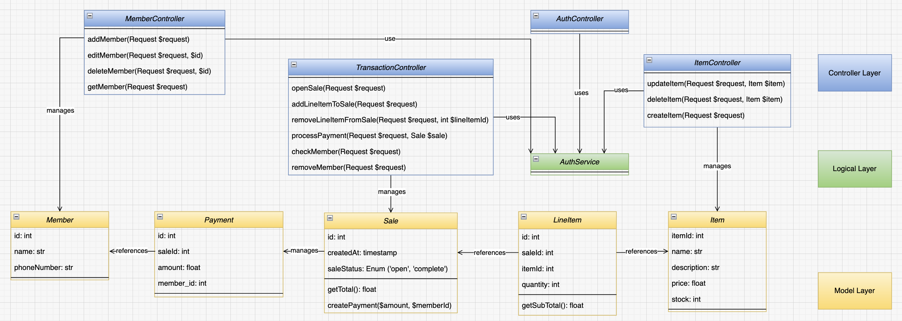

# POS (Point of Sale) Application

Our POS Application is a robust Laravel-based system designed for ease of use in managing sales, inventory, and customer membership. It is suitable for small to medium-sized retail businesses looking to digitize their sales processes.

## Installation

To set up the POS application, you need to follow these steps:

1. Clone the repository to your local machine.
2. Run `composer install` to install all the dependencies.
3. Create a `.env` file and configure your application and database settings.
4. Execute `php artisan migrate` to create the database schema.
5. (Optional) Seed your database with `php artisan db:seed` for initial data.

## Usage

After installation, you can access the POS system via your web browser. Log in with your user credentials and navigate through the interface to manage sales, inventory, and members.