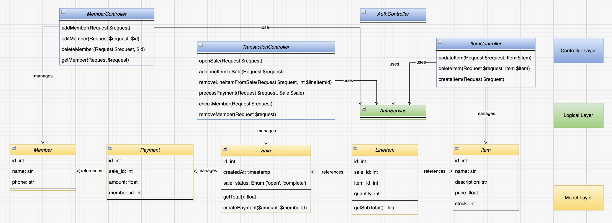

# POS (Point of Sale) Application

Our POS Application is a robust Laravel-based system designed for ease of use in managing sales, inventory, and customer memberships. It is suitable for small to medium-sized retail businesses looking to digitize their sales processes.



## Installation

To set up the POS application, follow these steps:

1. **Clone the repository** to your local machine.
   ```bash
   git clone <repository-url>
   ```
2. **Install dependencies** using Composer.
   ```bash
   composer install
   ```
3. **Create a `.env` file** and configure your application and database settings. You can start by copying the `.env.example` file.
   ```bash
   cp .env.example .env
   ```
4. **Generate an application key**.
   ```bash
   php artisan key:generate
   ```
5. **Create the database schema** by running migrations.
   ```bash
   php artisan migrate
   ```
6. (Optional) **Seed your database** with initial data.
   ```bash
   php artisan db:seed
   ```

## Usage

After installation, you can access the POS system via your web browser. Log in with your user credentials and navigate through the interface to manage sales, inventory, and members.

### Features and Workflow

The POS application streamlines the transaction process through an intuitive interface, enabling:

- **Viewing Sales**: Access the transactions tab to view ongoing and past sales.
- **Adding Line Items**: Dynamically add products to a sale, with real-time stock validation.
- **Applying Member Discounts**: Enter a member's phone number to apply available discounts to the sale.
- **Processing Payments**: Complete the transaction with an automatic calculation of totals and discounts.

## Sequence Diagram

The sequence diagram describes the interaction flow within a web application for processing transactions, including viewing sales, adding line items, checking for member discounts, and processing payments. Initially, when a user accesses the transactions tab, the system checks if there is an existing sale_id in the session. If found, it retrieves the corresponding Sale instance; otherwise, it creates a new Sale instance and stores its ID in the session.

When adding a line item to a sale, the system validates the request, checks if the requested quantity is available, and either updates the quantity of an existing line item or creates a new one, adjusting the item's stock accordingly. Success or error messages are returned based on the availability of the requested quantity.

For applying discounts, upon entering a phone number and clicking the discount button, the system validates the presence of a member associated with the provided phone number. If a member is found, a discount is applied, and member information is stored in the session. The transaction is processed by calculating the total sale amount, applying any discounts, creating a payment record, updating the sale status to complete, and clearing relevant session data. The flow concludes with a message indicating the successful processing of the payment, incorporating any applicable member discounts.


